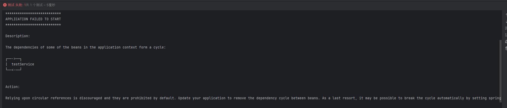
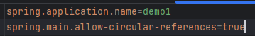
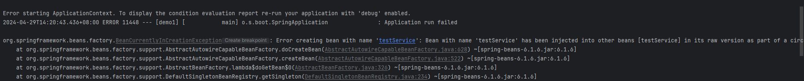
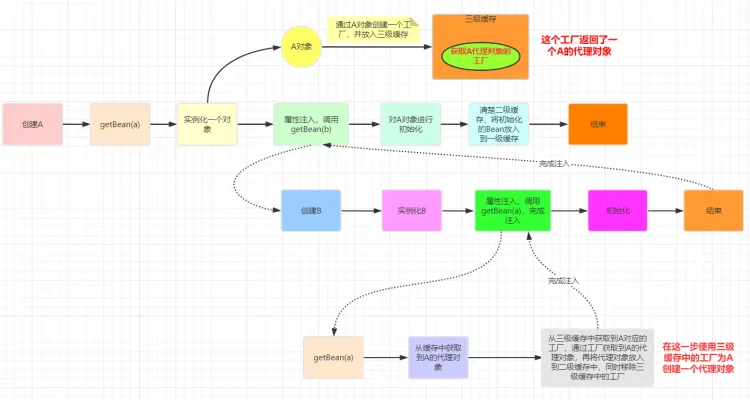
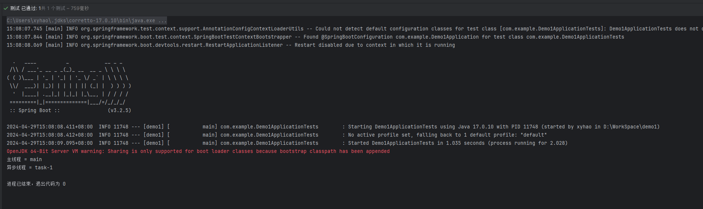

```java
@Service
public class TestService {

    @Resource
//    @Lazy
    private TestService testService;
    
    @Transactional(rollbackFor = Exception.class)
    public void test(){
        System.out.println("主线程 = " + Thread.currentThread().getName());
        testService.asyncTest();
    }

    @Async
    public void asyncTest(){
        System.out.println("异步线程 = " + Thread.currentThread().getName());
    }
}
```
```java
@SpringBootTest
class Demo1ApplicationTests {
    @Resource
    TestService testServiceInTest;
    
    @Test
    void contextLoads() {
        testServiceInTest.test();
    }
}
```

在没有使用懒加载之前，我在测试类中调用了test方法，输出如下所示：

出现了循环依赖问题。spring的输出信息提示：

`Action:
Relying upon circular references is discouraged and they are prohibited by default. Update your application to remove the dependency cycle between beans. As a last resort, it may be possible to break the cycle automatically by setting spring.main.allow-circular-references to true.
` 
根据提示，在配置文件中加入：


重新启动：


还是报错了，提示是：

`Error creating bean with name 'testService': Bean with name 'testService' has been injected into other beans [testService] in its raw version as part of a circular reference, but has eventually been wrapped. This means that said other beans do not use the final version of the bean. This is often the result of over-eager type matching - consider using 'getBeanNamesForType' with the 'allowEagerInit' flag turned off, for example.
`

在尝试创建名为 testService 的 Bean 时发生错误，原因是该 Bean（testService）在其原始形态下，由于循环引用的关系已被注入到其他 Bean 中（这里指的是它自己），最终这个 Bean 被包装了。
这意味着其他依赖于它的 Bean 实际上并没有使用最终版本的 testService Bean。这种情况经常是由于过于急切的类型匹配造成的——可以考虑使用如 getBeanNamesForType 方法时关闭 allowEagerInit 标志，来避免此类问题。

### **为什么还会报错？**
允许循环依赖之后重新启动，bean的属性注入步骤如下图所示：

要给TestService这个bean（以下称A）注入属性testService(以下称B)，

发现B在第一级缓存单例池中不存在，于是转而创建B这个bean

B的属性注入阶段会在第三级缓存中通过A的工厂获取到一个A的代理对象（对应了错误提示里的“Bean with name 'testService' has been injected into other beans [testService] in its raw version”，二级缓存中的早期bean对象）
，

报错提示中的`but has eventually been wrapped`其实就是指二级缓存中的A的代理对象在完成属性注入之后，被包装成了一级缓存单例池中的bean对象。

所以B对象注入的A属性是A的早期未包装的对象，而不是包装后的成熟对象。由这一点引发了报错。

解决这个方法可以参考提示中的`consider using 'getBeanNamesForType' with the 'allowEagerInit' flag turned off`


# 但是我认为使用懒加载的方式更加合适。一是简单，只需要加入一个注解即可。二是启动时更快，减少了加载bean的数量

最后放一个成功的截图吧：
